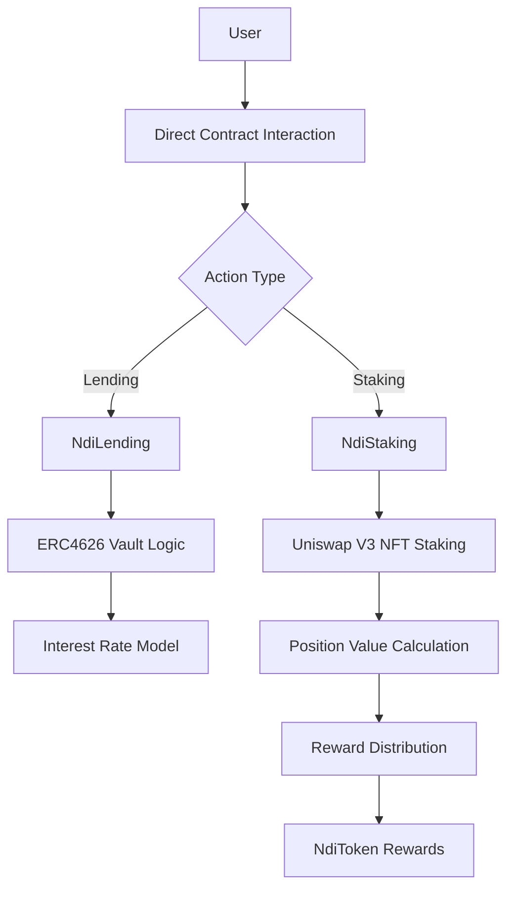

# Ndi-Fi

**Ndi-Fi** is a decentralized finance (DeFi) protocol for **lending and staking** on Ethereum and compatible chains. This repository contains all smart contracts, tests, deployment scripts, and protocol documentation for the project under the **Ndi-Fi** organization.

---

## 🚀 **Table of Contents**

- [About Ndi-Fi](#about-ndi-fi)
- [Folder Structure](#folder-structure)
- [Getting Started](#getting-started)
- [Development Workflow](#development-workflow)
- [Testing](#testing)
- [Deployment](#deployment)
- [Branching Strategy](#branching-strategy)
- [Contributing](#contributing)
- [License](#license)

---

## 🔗 **About Ndi-Fi**

Ndi-Fi provides secure and transparent lending and staking services using upgradeable smart contracts, ensuring flexibility and future-proofing protocol logic.

---

## 🗂️ **Folder Structure (MVP)**

```
Ndi-Fi/
├── src/                               # Smart contract source code (Foundry structure)
│   ├── core/                          # Core protocol contracts
│   │   ├── NdiLending.sol           # Main lending vault (ERC4626-based)
│   │   ├── NdiStaking.sol           # Uniswap V3 NFT staking vault
│   │   └── NdiInterestRate.sol      # Simple interest rate model
│   ├── interfaces/                    # Contract interfaces
│   │   ├── INdiLending.sol          
│   │   ├── INdiStaking.sol          
│   │   └── IUniswapV3Pool.sol         # Minimal Uniswap V3 interface
│   ├── libraries/                     # Utility libraries
│   │   ├── SafeMath.sol               # Mathematical operations
│   │   └── UniswapV3Utils.sol         # Uniswap V3 position utilities
│   ├── tokens/                        # Token contracts
│   │   ├── NdiToken.sol             # Protocol governance/reward token
│   │   └── nzETH.sol                  # Single wrapped lending token (MVP)
│   └── mocks/                         # Mock contracts for testing
│       ├── MockERC20.sol              
│       └── MockUniswapV3Pool.sol      
├── script/                            # Deployment scripts (Foundry)
│   ├── Deploy.s.sol                   # Main deployment script
│   └── SetupProtocol.s.sol            # Protocol initialization
├── test/                              # Test suites (Foundry)
│   ├── NdiLending.t.sol             # Lending tests
│   ├── NdiStaking.t.sol             # Staking tests
│   ├── Integration.t.sol              # Integration tests
│   └── helpers/                       # Test utilities
│       └── TestSetup.sol              
├── docs/                              # Documentation
│   ├── MVP-Overview.md                # MVP feature overview
│   ├── Lending-Guide.md               # How to use lending
│   ├── Staking-Guide.md               # How to stake NFTs
│   └── Architecture.md                # Technical architecture
├── foundry.toml                       # Foundry configuration
├── remappings.txt                     # Import path mappings
├── .env.example                       # Environment variables template
├── .gitignore                         
└── README.md                          
```


---

## 🎯 **MVP Features**

### **Core Functionality**
- **ETH Lending Only**: Single asset lending pool using ERC4626 standard
- **Uniswap V3 NFT Staking**: Direct NFT position staking (no LP tokens)
- **Simple Interest Model**: Basic fixed-rate interest calculation
- **Reward Distribution**: NdiToken rewards for stakers

### **MVP Limitations**
- Single asset (ETH) for lending
- No multi-asset support
- No liquidation mechanism
- No governance (admin-controlled)
- No price oracles
- Basic reward calculation

### **Future Expansions**
- Multi-asset lending (USDC, WBTC)
- Risk management & liquidations
- Governance token functionality
- Advanced yield strategies
- Cross-chain compatibility

---

## 🏗️ **Protocol Flow Architecture**

### **1. Core Protocol Flow**



### **2. Lending Protocol Architecture**

```
┌─────────────────┐    ┌─────────────────┐    ┌─────────────────┐
│   User Wallet   │    │   ndETH Token   │    │   ETH Asset     │
│                 │◄──►│  (ERC4626)      │◄──►│                 │
└─────────────────┘    └─────────────────┘    └─────────────────┘
         │                       │                       │
         │                       │                       │
         ▼                       ▼                       ▼
┌─────────────────────────────────────────────────────────────────┐
│                    Ndi-Lending (ERC4626)                       │
│  ┌─────────────┐  ┌─────────────┐  ┌─────────────────────────┐  │
│  │   Deposit   │  │  Withdraw   │  │    Interest Rate        │  │
│  │   Logic     │  │   Logic     │  │      Model              │  │
│  └─────────────┘  └─────────────┘  └─────────────────────────┘  │
└─────────────────────────────────────────────────────────────────┘
```

### **3. Staking Protocol Architecture (Uniswap V3 NFTs)**

```
┌─────────────────┐    ┌─────────────────┐    ┌─────────────────┐
│ Uniswap V3 NFT  │    │ Staking Vault   │    │ Reward Pool     │
│   Positions     │◄──►│                 │◄──►│ (NdiToken)    │
└─────────────────┘    └─────────────────┘    └─────────────────┘
         │                       │                       │
         ▼                       ▼                       ▼
┌─────────────────────────────────────────────────────────────────┐
│                    NdiStaking                                 │
│  ┌─────────────┐  ┌─────────────┐  ┌─────────────────────────┐  │
│  │   Stake     │  │  Unstake    │  │   Position Value        │  │
│  │   NFT       │  │   NFT       │  │   Calculation           │  │
│  └─────────────┘  └─────────────┘  └─────────────────────────┘  │
└─────────────────────────────────────────────────────────────────┘
         │                       │                       │
         ▼                       ▼                       ▼
┌─────────────────┐    ┌─────────────────┐    ┌─────────────────┐
│ Uniswap V3      │    │   Time-based    │    │   Emergency     │
│ Integration     │    │   Rewards       │    │   Functions     │
└─────────────────┘    └─────────────────┘    └─────────────────┘
```

### **4. MVP Integration Layer**

```
┌─────────────────────────────────────────────────────────────────┐
│                      External Integrations                      │
├─────────────────────────────┬───────────────────────────────────┤
│        Uniswap V3           │         OpenZeppelin              │
│  ┌─────────────────────┐    │  ┌─────────────────────────────┐  │
│  │  NFT Position       │    │  │    ERC4626 Standard         │  │
│  │  Manager            │    │  │    Access Control           │  │
│  │  Pool Interaction   │    │  │    Security Features        │  │
│  └─────────────────────┘    │  └─────────────────────────────┘  │
└─────────────────────────────┴───────────────────────────────────┘
```

---

## 🔄 **Development Workflow**

1. **Local Development**: `contracts/`, `test/`, `scripts/`
2. **Testing**: Unit → Integration → E2E testing
3. **Deployment**: Testnet → Mainnet via `scripts/deploy/`
4. **Monitoring**: Protocol metrics and security monitoring
5. **Upgrades**: Managed through proxy contracts and governance

---

## 🛡️ **Security Architecture**

- **Upgradeable Contracts**: OpenZeppelin proxy pattern
- **Access Control**: Role-based permissions
- **Emergency Functions**: Pause mechanism and emergency withdrawals
- **Audit Trail**: Comprehensive event logging
- **Price Oracle**: Chainlink integration for secure price feeds

---

